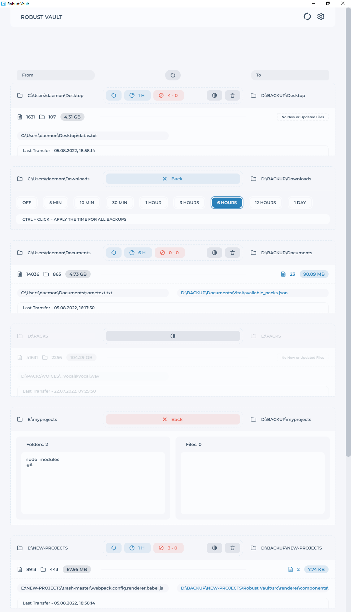

<kbd>
  
</kbd>

# Robust Vault

### Backup your data from anywhere to anywhere.

    Only for local computer disks, cloud backups are not available (yet).
    Support platforms: Windows (x32, x64).

# Under Hood

-   Recursive Backup - **Folders**, **Files** moves with auto dir creations.
-   Files Comparison by **Size** and **Modified Time** to determine which files was already copied and they are up to date.

# Features

-   **Scheduled Backups** - Backups your files with intervals.

    -   `OFF` - Disable Scheduled Backups
    -   `5 MIN`
    -   `10 MIN`
    -   `30 MIN`
    -   `1 HOUR`
    -   `3 HOURS`
    -   `6 HOURS`
    -   `12 HOURS`
    -   `1 DAY`

-   **Force Backup** - Manually Run.
-   **Black List** - Will skip **Folders** and **Files**.
-   **Enable/Disable** - On/Off backuping.
-   **Last Files** - Shows the last **Passed** and **Moved** files.
-   **Stat** - Shows the **Passed** and **Moved** amount of files, directories and sizes.

# Black List

Should be a string, one item per row.

Example Directory (no full path):

> node_modules

Example File (with extension):

> myphoto.png
